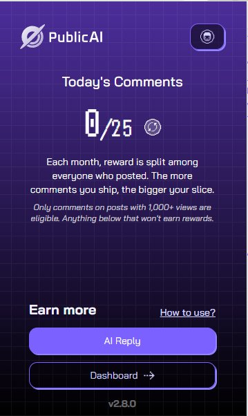
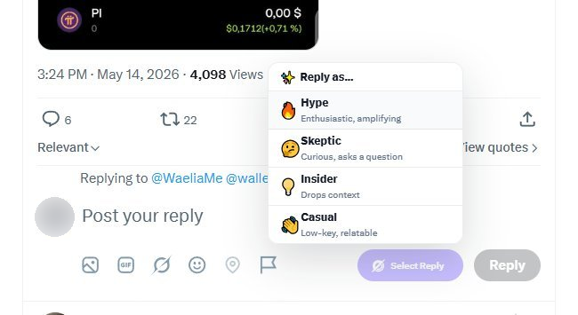

# Data Hunter 2.0

## Intro

[PublicAI Data Hunter](https://chromewebstore.google.com/detail/publicai-data-hunter/icbbdjflabjciapbohkkkmaangfjaanl?utm_source=gitbook) is a seamless Chrome extension allows you to contribute to AI development while earning rewards. Users can choose to reply to high-quality tweets they come across while browsing X using the new AI Reply feature in Data Hunter.&#x20;

You will need to login with your [PublicAI Data Hub](https://beta.publicai.io/login) account before you start earning.&#x20;

## Installation

#### Step 1 — Install the DataHunter Chrome extension

1. Open the Chrome Web Store listing for [DataHunter](https://chromewebstore.google.com/detail/publicai-data-hunter/icbbdjflabjciapbohkkkmaangfjaanl).
2. Click **Add to Chrome**, then confirm **Add extension** in the popup.
3. After installation, the DataHunter icon will appear in your browser toolbar.

> **Tip:** If you don't see the icon, click the puzzle-piece icon in the top-right of Chrome and pin DataHunter so it's always visible.

#### Step 2 — DataHub account

DataHunter uses [DataHub](https://beta.publicai.io/login) to manage your identity, wallet, and rewards.

**If you already have a DataHub account:**

1. Click the DataHunter icon in your toolbar.

**If you don't have a DataHub account yet:**

1. Visit [DataHub](https://beta.publicai.io/login).
2. Create your account using email or wallet. **Make sure to bind your X account**.&#x20;
3. Return to the DataHunter extension and sign in.

You'll need both the extension _and_ a DataHub account to earn rewards.

***

### How to post your first AI reply

This guide walks you through your first reward-eligible comment using DataHunter. The whole flow takes about a minute once your account is set up.

***

#### Step 1 — Open DataHunter and connect your account

Click the DataHunter icon in your Chrome toolbar. You'll see a welcome screen with the **Connect Account** button.

Click **Connect Account** and sign in with your DataHub X log-in. If you don't have a DataHub account yet, you'll need to create one first.

<figure><figcaption></figcaption></figure>

<figure><figcaption></figcaption></figure>

***

#### Step 2 — Click "AI Reply" in the popup

After signing in, the DataHunter popup shows your **Today's Comments** counter (e.g. `0/25`)&#x20;

Click the purple **AI Reply** button at the bottom of the popup. This opens X in a new tab.

<figure><figcaption></figcaption></figure>

> If you're already logged into X in your browser, you'll go straight to your timeline. If not, X will prompt you to log in — use your normal X credentials.

***

#### Step 3 — Find a post worth replying to

By default, we'll show you a list of recommended posts to reply to. Pick a post that fits the campaign. Good candidates:

* **Trading, crypto, AI, Finance, or AI agent topics**&#x20;
* **News-worthy posts** — partnerships, launches, market events
* **Posts with 1,000+ views** — these are the only ones eligible for rewards

Avoid replying to posts about politics, drama, tragedies, or anything off-topic. Off-topic comments don't help the campaign and won't earn rewards.

When you find a good post, click **Reply** as you normally would on X.

***

#### Step 4 — Pick a voice

Once the reply box is open, you'll see a pink **Select Reply** button next to X's native Reply button. Click it.

<figure><figcaption></figcaption></figure>

A small menu drops down with four voices:

* 🔥 **Hype** — Enthusiastic, amplifying
* 🤔 **Skeptic** — Curious, asks a question
* 💡 **Insider** — Drops context
* 👋 **Casual** — Low-key, relatable

Pick the voice that best fits the post. DataHunter generates a comment in that voice and fills it into the reply box automatically.

#### Step 5 — Review and post

Your generated comment appears in the reply box, including hashtags or mentions like `#agentica` or `@agenticatrade` when relevant. 

<figure><figcaption></figcaption></figure>

**Before you post:**

* Read the comment to make sure it fits the conversation
* Light edits are fine — tweak wording, adjust tone, fix anything that feels off
* Make sure you're following [X's community guidelines](https://help.x.com/en/rules-and-policies/x-rules) — don't post in restricted topics, don't spam, don't harass

> **Note about tags:** Sometimes the AI generates a comment without `#agentica` or `@agenticatrade` visible. Don't worry if a comment doesn't include them; it still counts.

When you're happy with the comment, click X's black **Reply** button to post it.


One reply per post. Only the first counts toward rewards, and repeat replies on the same post may flag your account for spam.&#x20;


#### What happens next

* Your **Today's Comments** counter ticks up by 1
* You earn one share of this month's reward pool
* The comment counts toward your monthly payout

You can post up to **25 comments per day**. Rewards are paid out at the end of each month in $PUBLIC or USDT.


All posts are reviewed. Spam, abuse, or rule violations result in a permanent ban and forfeiture of all rewards. Be respectful.


