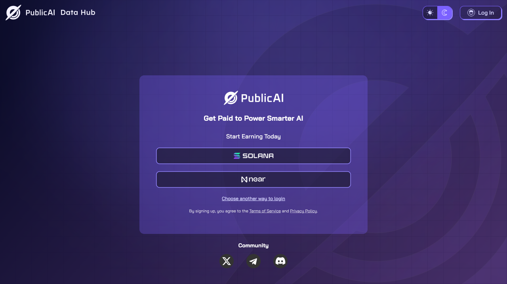

# 🧑‍💻 Signup & Login

<figure><figcaption></figcaption></figure>

#### **Signup**&#x20;

To create an account, use your email to complete the registration form. Your application will then undergo an approval process, and you will be notified of the decision.

**Quick and Easy Log-in Options for Existing Users and After Registration**&#x20;

* **X Login:** Sign in seamlessly using your X account.

These options are designed for convenience so that you can dive into the PublicAI ecosystem with minimal setup.

<figure><figcaption></figcaption></figure>

**Advanced Option: Wallet Login**

For those who prioritize privacy and decentralization, we also offer a wallet login option compatible with **Solana** and **Near Protocol**. This is perfect for users who prefer to keep their participation anonymous while maintaining full ownership of their credentials.
