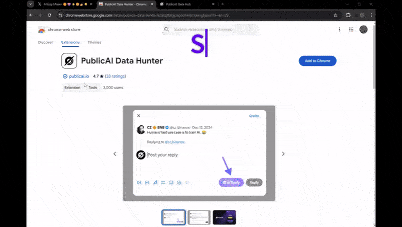
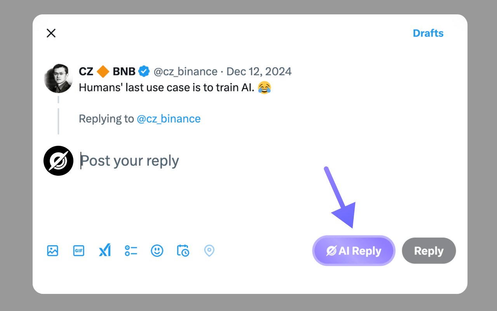
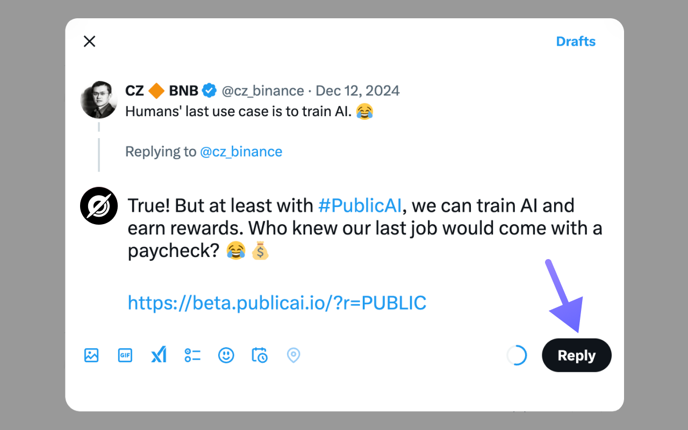

# 👷 AI Tool for X

<figure><figcaption>
Busy? AI Reply Speed Run!
</figcaption></figure>

The PublicAI Data Hunter extension is a powerful AI agent tool for assisted posting.

**Step 1:** Click on "Earn More": Navigate to the social media page.

**Step 2:** Find Trending Posts: Look for popular posts, ideally those with over 1k views, to maximize your reach.

<figure><figcaption>
Select popular posts to reply
</figcaption></figure>

**Step 3:** Click "Reply": In the text box, select "PublicAI Reply" to automatically generate a promotional message. Post it to earn points for every valid invitation!

<figure><figcaption>
Reply to influential post
</figcaption></figure>

Want to earn even more? Use your personal [Referral Link](../publicai-referrals.md) to invite your friends to the fun!

