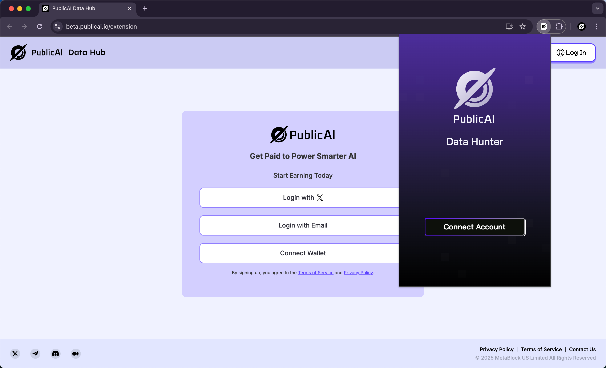
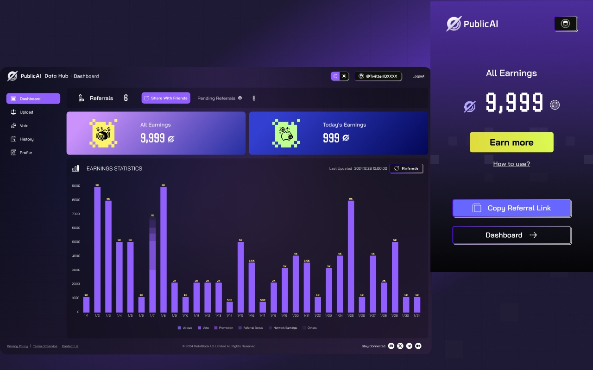

# ⬇️ Download & Connect Account

## Download

First, click [this link](https://chromewebstore.google.com/detail/publicai-data-hunter/icbbdjflabjciapbohkkkmaangfjaanl?utm_source=gitbook) to download the Data Hunter extension from the Chrome Web Store while using Chrome.

For best results use the Chrome Desktop browser. Mobile browsers with extension support like Mises and Kiwi are not officially supported.&#x20;

## Accept Permissions

<figure><figcaption>
Accept Permissions
</figcaption></figure>

Curious what each of the permissions is used for? Let's break it down:

* **Site Access:** Reads the tweet you're replying to and inserts an AI reply.
* **Display Notifications:** Prompts login if your account disconnects.
* **Modify data you copy and paste:** Simplifies copying your referral link.

## Sign up & Bind Account

After downloading the plugin, pin it to the top right of Chrome and click our logo in the top right to launch Data Hunter.

<figure><figcaption>
Data Hunter's page will be displayed as shown in the image above.
</figcaption></figure>

Next, click the **"Connect Account"** button. The extension will guide you to the PublicAI login page, where you can log in using your X account,  Wallet address and Email. Once logged in, you can start using the Data Hunter extension.

<figure><figcaption>
Once Logged In and Successfully Linked
</figcaption></figure>

After logging in successfully, click the Data Hunter logo in the top right again to see your information. Now, you can earn by leaving your browser open and using the [AI Reply](ai-tool-for-x.md) feature on X.&#x20;
