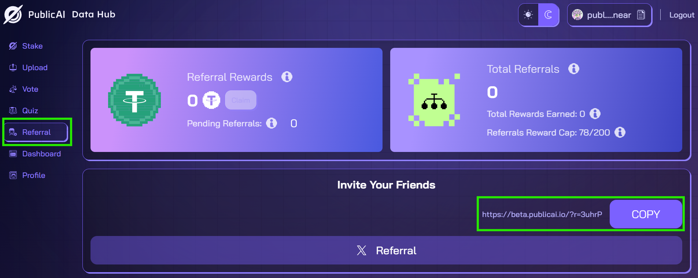

# 👨‍👨‍👧‍👧 PublicAI Referrals

<figure><figcaption>
<a href="https://beta.publicai.io/referral">https://beta.publicai.io/referral</a>
</figcaption></figure>

Every time your friends join and complete the required tasks, you’ll receive a reward!\
Here's how it works:

1. **Refer your friends**
   1. Share the link with your friends over x or any other social platform!
2. **Your Friend Signs Up**
   1. Be sure they sign up using your referral link.
   2. Your friend will need to complete and pass the new user on-boarding survey. Remind your friend to fill in their information authentically and completely, or they will be rejected by the human reviewers who check each submission by hand.&#x20;
   3. Due to high volume of submissions, survey reviews are prioritized by how complete a new users profile is. To ensure they move through this step quickly, have your friend bind as many social accounts (email, x, discord, etc) and wallets (BNB, NEAR, SOL) as possible.&#x20;
3. **Your Friend Uploads**
   1. Once your friend uploads and has the required 140 samples accepted, you will receive your reward!
   2. Remind your friend to upload every day until they have hit the 140 accepted uploads.&#x20;

<mark style="color:red;">**Disclaimer:**</mark>&#x20;

* Rewards are awarded for one task completion when all the criteria have been met.&#x20;
* Referral reward claims are limited to 200 per week. Think of it as first-come, first-served. Successful referrals carry over for claiming in future weeks.
* Rewards may be revoked if fraud or abuse is detected (on-chain or off-chain).
* Referral Reward program may be suspended at any time.
