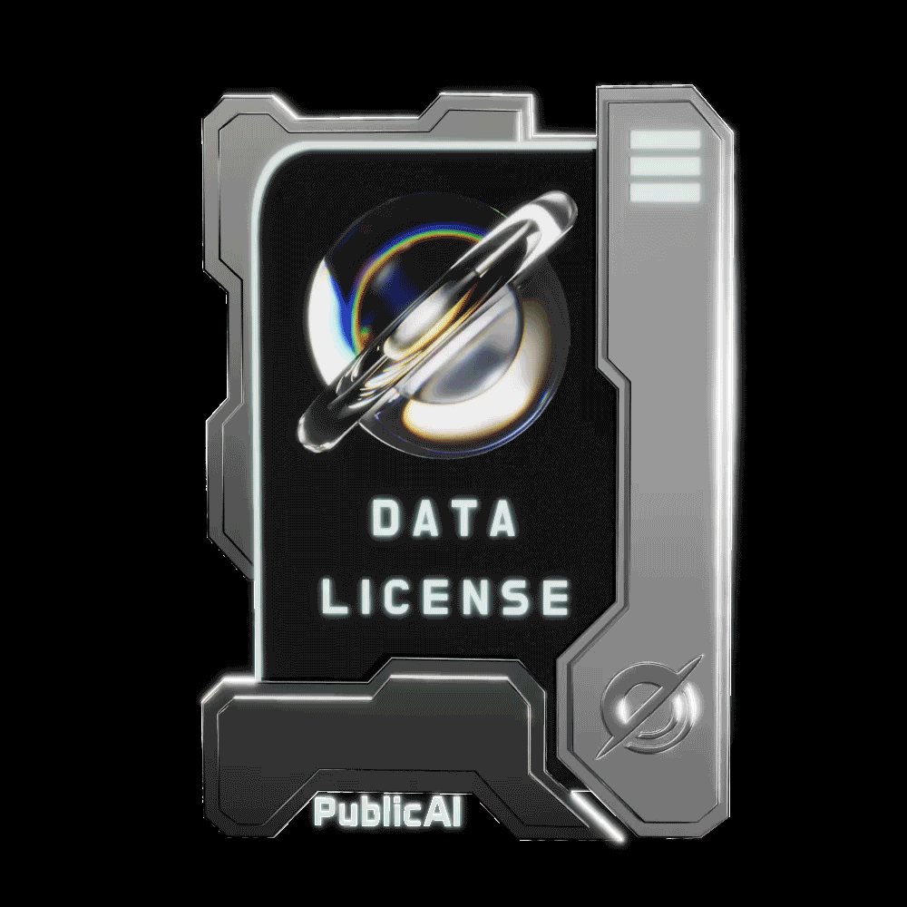

# 🪪 UAD License SBT

## ABC We will lauch the token in Novber

ABC We will lauch the token in Novber

## Background

The **UAD(User Authorized AI Data) License** champions user data ownership and equitable AI profit sharing, addressing the inevitable demand for ethical data practices among future AI enterprises, ensuring transparency and sustainability in the evolving digital landscape.

## Function

The PublicAI Data License SBT is Soulbound Token of UAD (User Authorized AI Data) License, which, once minted, becomes bound to the corresponding Solana wallet and cannot be transferred or traded. It serves merely as an identity license.

<figure><figcaption>
UAD License SBT (Silver)
</figcaption></figure>

When you hold it, you truly possess the ownership and dividend rights of your social media dataset, enabling you to convert your **$PUBLIC Points** into **$PUBLIC tokens** on the blockchain.
